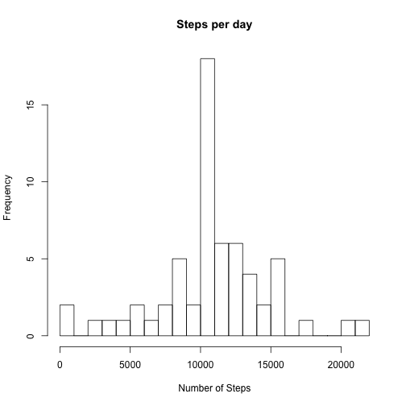

## Loading and preprocessing the data

The data exists in the root folder of the project as a Zip file. Inside, there is the *activity.csv* data which contains the actual data.


```r
unzip("./activity.zip")
data <- read.csv("./activity.csv")
clean_data <- data
```

At this point for my analysis there is no need to do any preprocessing on the data. So the *clean_data* variable is really redundant here, but I am keeping it in case I want to work on it.

## What is mean total number of steps taken per day?

The first thing we want to analyse is the pattern that the steps follow per day. For this we will take the sum of the total of steps per each day.


```r
grouped <- group_by(clean_data, date)
summary <- summarise(grouped, steps_per_day = sum(steps, na.rm= TRUE))
```

And then graphically show this values.
 

```r
hist(summary$steps_per_day, breaks = 20, main = "Steps per day" , xlab = "Number of Steps")
```

 

Then we take the *mean* and *median* per all days, and per each individual day


```r
means_per_day <- summarise(grouped, mean_steps = mean(steps, na.rm= TRUE))
medians_per_day <- summarise(grouped, median_steps = median(steps, na.rm= TRUE))

mediam_of_the_total_steps <- median(summary[,"steps_per_day"][[1]], na.rm= TRUE)
mean_of_the_total_steps <- mean(summary[,"steps_per_day"][[1]], na.rm= TRUE)
```


### Per day


```r
  kable(means_per_day, format = "markdown")
```


|date       | mean_steps|
|:----------|----------:|
|2012-10-01 |        NaN|
|2012-10-02 |  0.4375000|
|2012-10-03 | 39.4166667|
|2012-10-04 | 42.0694444|
|2012-10-05 | 46.1597222|
|2012-10-06 | 53.5416667|
|2012-10-07 | 38.2465278|
|2012-10-08 |        NaN|
|2012-10-09 | 44.4826389|
|2012-10-10 | 34.3750000|
|2012-10-11 | 35.7777778|
|2012-10-12 | 60.3541667|
|2012-10-13 | 43.1458333|
|2012-10-14 | 52.4236111|
|2012-10-15 | 35.2048611|
|2012-10-16 | 52.3750000|
|2012-10-17 | 46.7083333|
|2012-10-18 | 34.9166667|
|2012-10-19 | 41.0729167|
|2012-10-20 | 36.0937500|
|2012-10-21 | 30.6284722|
|2012-10-22 | 46.7361111|
|2012-10-23 | 30.9652778|
|2012-10-24 | 29.0104167|
|2012-10-25 |  8.6527778|
|2012-10-26 | 23.5347222|
|2012-10-27 | 35.1354167|
|2012-10-28 | 39.7847222|
|2012-10-29 | 17.4236111|
|2012-10-30 | 34.0937500|
|2012-10-31 | 53.5208333|
|2012-11-01 |        NaN|
|2012-11-02 | 36.8055556|
|2012-11-03 | 36.7048611|
|2012-11-04 |        NaN|
|2012-11-05 | 36.2465278|
|2012-11-06 | 28.9375000|
|2012-11-07 | 44.7326389|
|2012-11-08 | 11.1770833|
|2012-11-09 |        NaN|
|2012-11-10 |        NaN|
|2012-11-11 | 43.7777778|
|2012-11-12 | 37.3784722|
|2012-11-13 | 25.4722222|
|2012-11-14 |        NaN|
|2012-11-15 |  0.1423611|
|2012-11-16 | 18.8923611|
|2012-11-17 | 49.7881944|
|2012-11-18 | 52.4652778|
|2012-11-19 | 30.6979167|
|2012-11-20 | 15.5277778|
|2012-11-21 | 44.3993056|
|2012-11-22 | 70.9270833|
|2012-11-23 | 73.5902778|
|2012-11-24 | 50.2708333|
|2012-11-25 | 41.0902778|
|2012-11-26 | 38.7569444|
|2012-11-27 | 47.3819444|
|2012-11-28 | 35.3576389|
|2012-11-29 | 24.4687500|
|2012-11-30 |        NaN|

In this case medians are all 0.


### Per all days


```r
 df_mean <- data.frame(total_mean_per_day = mean_of_the_total_steps)
 df_median <- data.frame(total_median_per_day = mediam_of_the_total_steps)
 kable(df_mean, format = "markdown")
```


| total_mean_per_day|
|------------------:|
|            9354.23|

```r
 kable(df_median, format = "markdown")
```


| total_median_per_day|
|--------------------:|
|                10395|


## What is the average daily activity pattern?

Here we want to group the data per interval, across al days. BAsically we want to get the mean of steps for each interval calculated for all the days.


```r
grouped_interval <- group_by(clean_data, interval)
means_per_interval <- summarise(grouped_interval, mean_steps = mean(steps, na.rm= TRUE))
```

Then we plot this information in a time series plot


```r
plot(means_per_interval, type = "l", ylab = "Average Steps")
```

 

Then we check which of these intervals is the one with the greatest number of steps


```r
max_per_interval <- filter(means_per_interval, mean_steps == summarise(means_per_interval, max = max(mean_steps, na.rm= TRUE))[[1]])
kable(max_per_interval)
```


| interval| mean_steps|
|--------:|----------:|
|      835|   206.1698|
## Imputing missing values

Now we need to work on the missing values. For this, we first identify the `NA`s and count them


```r
nas <- filter(data, is.na(steps))
number_of_nas = count(nas)[[1]]
kable(data.frame(number_of_nas = number_of_nas))
```


| number_of_nas|
|-------------:|
|          2304|

Then we create a new dataset that is a copy of the original dataset but with all the NAs replaced with the means for its respective interval.


```r
merged <- merge(means_per_interval, nas, by.x = "interval", by.y = "interval")
nas_as_means <- select(mutate(select(merged, mean_steps, date, interval), steps = mean_steps), steps, date, interval)

no_nas_data <- filter(data, !is.na(steps))
all_data = rbind(no_nas_data, nas_as_means)
```

Now we use this dataset to make the same calculations and histogram we made at the beggining with the original dataset.


```r
grouped2 <- group_by(all_data, date)
summary2 <- summarise(grouped2, steps_per_day = sum(steps))
hist(summary2$steps_per_day, breaks = 20, main = "Steps per day" , xlab = "Number of Steps")
```

 

And we check the new values for *mean* and *median*

```r
means_per_day2 <- summarise(grouped2, mean_steps = mean(steps, na.rm = TRUE))
medians_per_day2 <- summarise(grouped2, median_steps = median(steps, na.rm = TRUE))

mediam_of_the_total_steps2 <- median(summary2[,"steps_per_day"][[1]])
mean_of_the_total_steps2 <- mean(summary2[,"steps_per_day"][[1]])
df_mean2 <- data.frame(total_mean_per_day = mean_of_the_total_steps2)
df_median2 <- data.frame(total_median_per_day = mediam_of_the_total_steps2)
kable(df_mean2, format = "markdown")
```


| total_mean_per_day|
|------------------:|
|           10766.19|

```r
kable(df_median2, format = "markdown")
```


| total_median_per_day|
|--------------------:|
|             10766.19|

Comparing the values from both *histograms* and also from the mean and median values, we can see that the histogram as expected have an even greater concentration of values among the mean of the graph. This is due to all the new values matching that value.

From the means and median, the kept more or less similar to their previous values. But we can see now that they actually match each other now.

## Are there differences in activity patterns between weekdays and weekends?

The final analysis we want to do is compare the steps patterns between weekdays and weekends. 
We will do this graphically, showing two adjacent plots for each of the two factors (weekday and weekend) and checking on the average steps per interval


```r
all_data$day_of_week <- ifelse(weekdays(as.Date(all_data$date)) == "Saturday" | weekdays(as.Date(all_data$date)) == "Sunday" ,"weekend","weekday")
all_data$day_of_week <- as.factor(all_data$day_of_week)

grouped_by_weekday <- group_by(all_data, day_of_week, interval)
summary_weekday <- summarise(grouped_by_weekday, steps = mean(steps, na.rm = TRUE))

library(ggplot2)

plot <- qplot(interval, steps, data = summary_weekday, facets = day_of_week ~ ., geom = c("line"))
print(plot)
```

 

A fair conclusion to get here is that people walks a lot more on certain peak intervals on weekdays than on weekends. Weekends look more uniform during the day.
